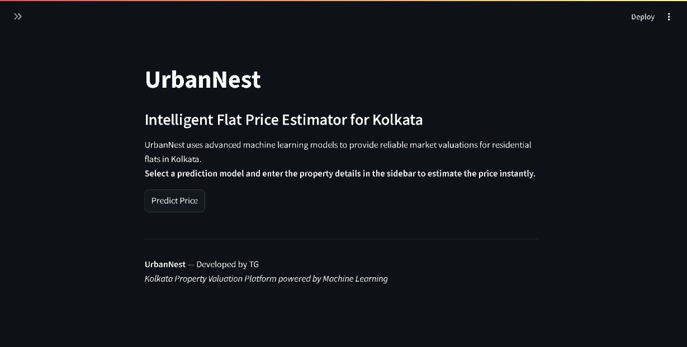
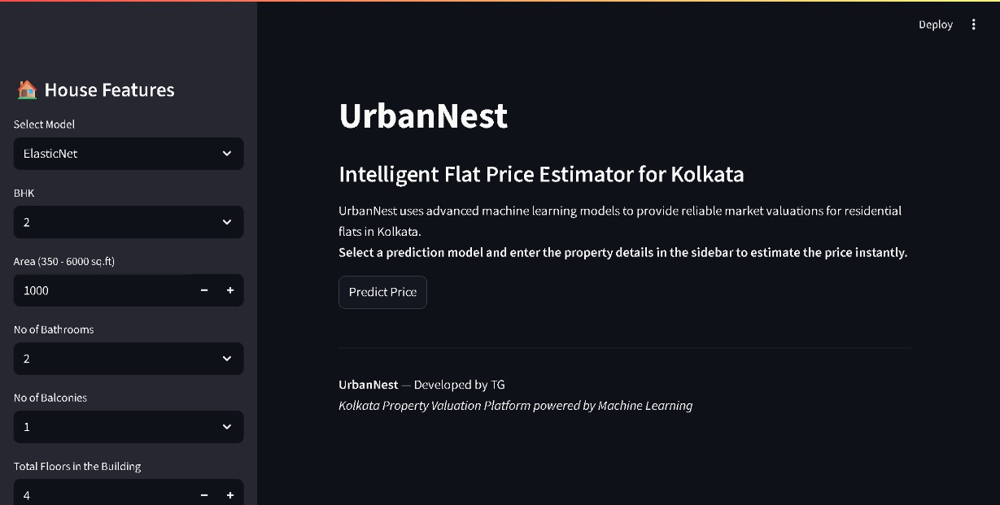
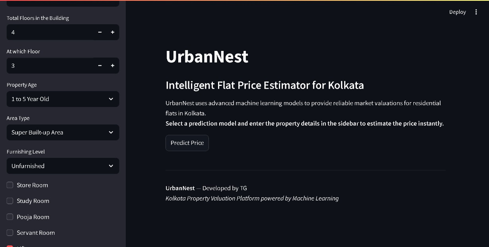
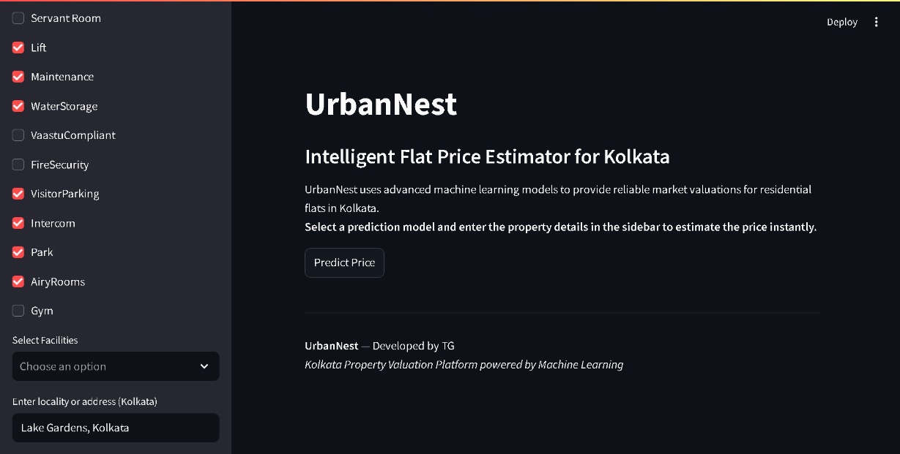
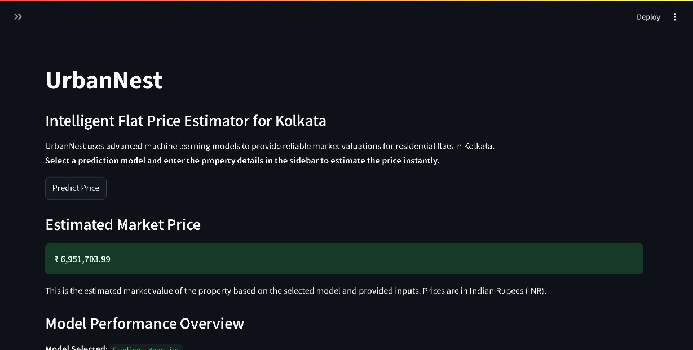
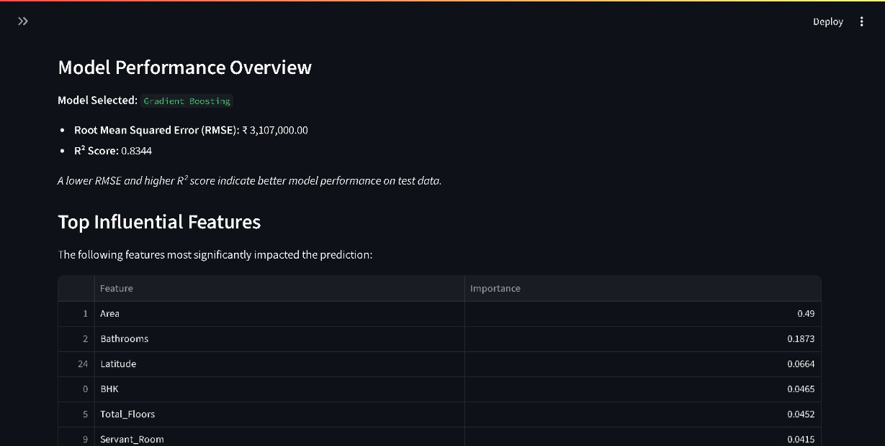
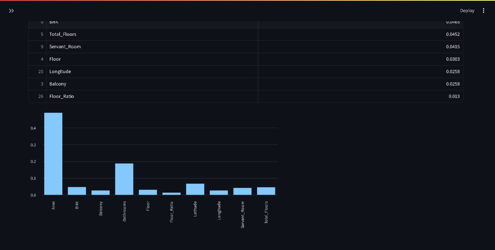

# UrbanNest: Flat Price Estimation for Kolkata

UrbanNest is a **learning-focused, end-to-end machine learning project** that explores how real-world property data can be transformed into usable price estimates through regression models and a simple user-facing application.

> While my primary interests lie in **C++ and systems-oriented software**, this project reflects my experience working with data pipelines, model comparison, and practical deployment trade-offs.

---

## ■ Project Overview

The goal of UrbanNest is to estimate residential flat prices in the Kolkata metropolitan region based on structured property attributes.  
The project covers the full workflow:

- Data preprocessing and feature engineering  
- Training and evaluating multiple regression models  
- Comparing model performance using standard metrics  
- Exposing predictions through a lightweight Streamlit interface  

The focus is on **understanding model behavior and limitations**, rather than achieving maximum accuracy.

---

## ■ Models Used

The following regression models were trained and evaluated:

- ElasticNet  
- Random Forest  
- Gradient Boosting  
- XGBoost  

Users can select a model and input property details such as BHK, area, floor, amenities, furnishing level, and location.

Geographical features (latitude and longitude) are derived from address inputs using geolocation services.

---

## ■ Dataset Summary

- Source: Flat listings from **99acres (Kolkata region)**
- Size: ~1,100 entries with 30+ features
- Feature categories:
  - Structural: BHK, area, floor, bathrooms, balconies
  - Amenities: lift, park, gym, servant room, etc.
  - Premium facilities: swimming pool, power backup, clubhouse
  - Geographical: latitude, longitude

**Target variable:** Price (in INR Lakhs)

---

## ■ Model Performance (Validation)

| Model             | RMSE (₹ Lakhs) | R² Score |
|------------------|---------------|----------|
| ElasticNet        | 36.35         | 0.7733   |
| Random Forest     | 35.48         | 0.7840   |
| Gradient Boosting | 31.07         | 0.8344   |
| XGBoost           | 30.30         | 0.8425   |

XGBoost achieved the best overall performance on the validation set among the tested models.

---

## ■ Application Interface

### Main Interface



### Feature Input Sidebar



### Prediction Output




---

## ■ Running the Application

### Prerequisites
- Python 3.7+
- Required libraries:

```bash
pip install streamlit pandas numpy joblib geopy
```

### Run

```bash
streamlit run app.py
```

Steps:

1. Enter property details using the sidebar
2. Select a regression model
3. Click **Predict Price** to view the estimated value

---

## ■ Limitations & Learnings

* The dataset is region-specific and does not generalize beyond Kolkata
* Listing prices may contain market and reporting bias
* Model predictions should be treated as **indicative**, not definitive
* Learned the importance of feature selection, leakage control, and validation
* Gained hands-on experience comparing tree-based models in practice
